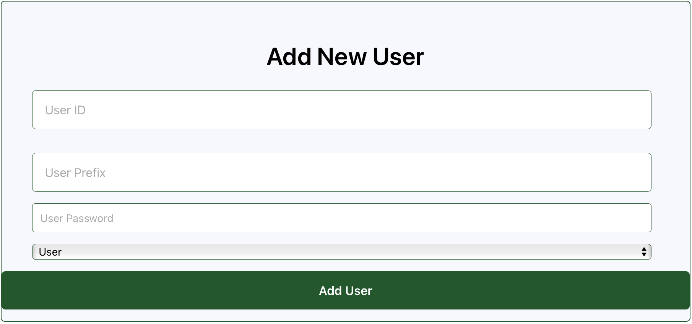
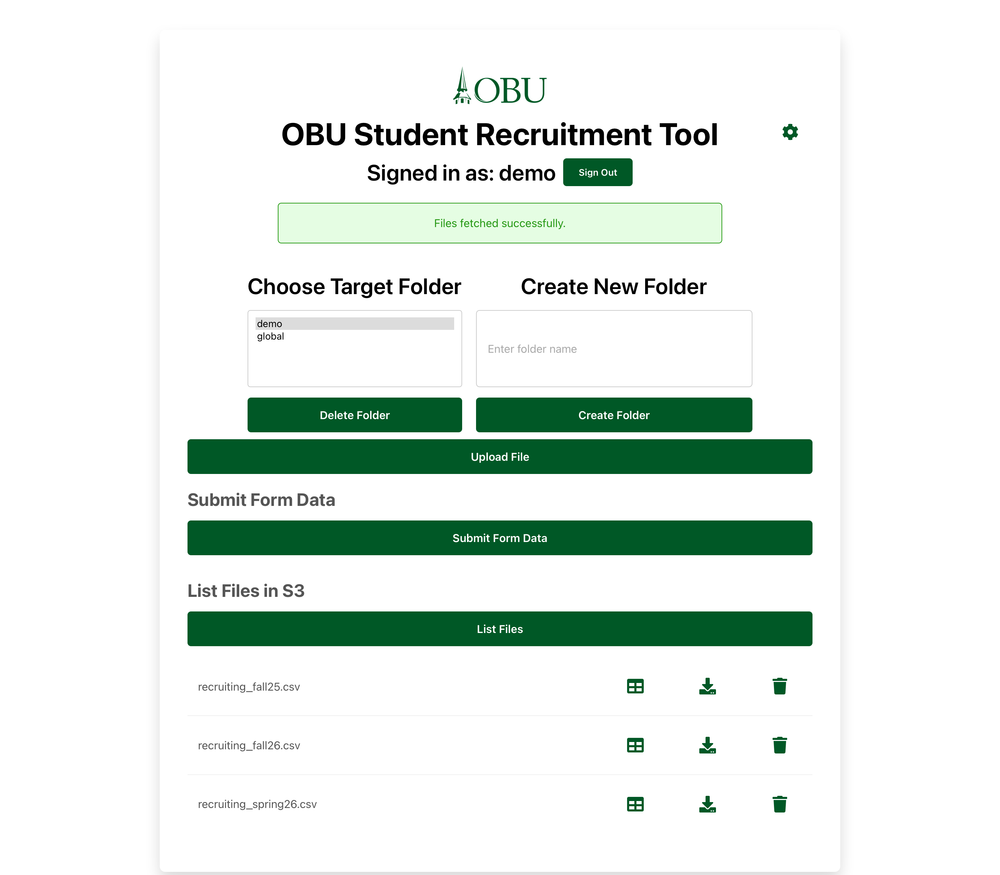
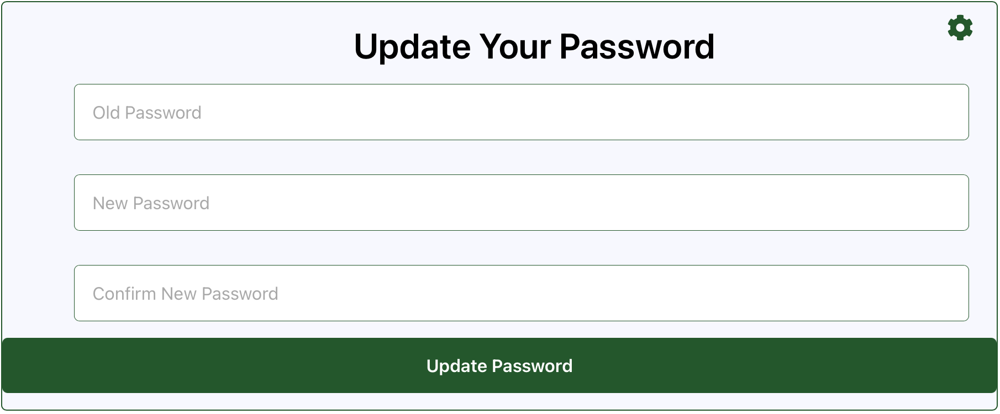
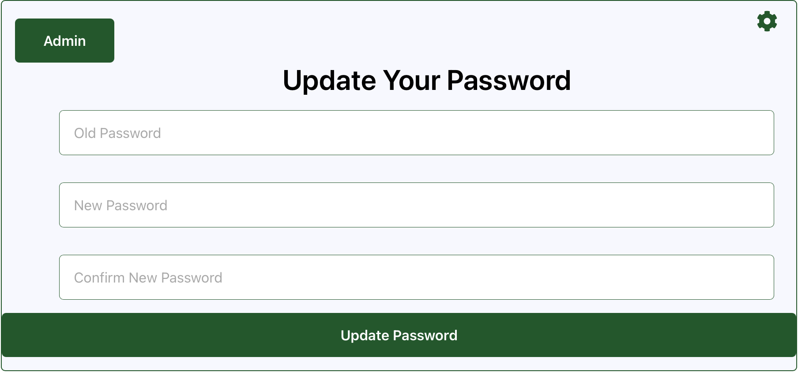

# OBU Student Recruitment

## Table of Contents
## Table of Contents
1. [Getting Started](#getting-started)
   - [Flask Back End](#flask-back-end)
     - [Setup](#setup)
     - [Activate The Server](#activate-the-server)
     - [Troubleshooting Conda Environment](#troubleshooting-conda-environment)
   - [React Front End](#react-front-end)
2. [Client-Side Information](#client-side-information)
   - [Managing Users Page](#managing-users-page)
     - [Admin Functions](#admin-functions)
   - [Main User Page](#main-user-page)
     - [Available Actions](#available-actions)
3. [Predictive Model Information](#predictive-model-information)
   - [Models](#models)
   - [Running The Model](#running-the-model)
   - [Model Input](#model-input)
   - [Model Output](#model-output)
   - [JSON](#json-format)
4. [Back End API](#back-end-api)
   - [flask_server.py Routes](#flask_serverpy-routes)
   - [s3_server.py Routes](#s3_routespy-routes)
5. [Running Backend Container](#running-backend-container)
---

## Other Useful Information
1. [React](react/README.md)
2. [S3](api/S3_README.md)
3. [Field Values](api/data-field-values.md)

---

# Getting Started
## Flask Back End

### Setup
To run the project, Conda must first be installed. Once Conda is installed, navigate to the `api/scripts` folder and run one of the following commands to create an environment and install dependencies:

- **Unix/Linux/macOS:**
  ```bash
  bash setup-env-unix.sh
  ```
- **Windows (TODO):**
  - Create a PowerShell script for setup.

This creates an environment named `stu-rec` that contains all the necessary dependencies for the backend API.

### Activate The Server
1. Activate the Conda environment:
   ```bash
   conda activate stu-rec
   ```
2. Navigate to the `api` folder and start the Flask server:
   ```bash
   python flask_server.py
   ```

The Flask server runs on host `0.0.0.0` and port `6000` by default, but these settings can be modified in `config.json`.

### Troubleshooting Conda Environment
If you encounter issues with your Conda environment, refer to [TroubleShootConda.md](api/scripts/TroubleShootConda.md) for troubleshooting options.

## React Front End
To start the React app:
1. Navigate to the `react` folder:
    ```bash
    cd react
    ```
2. Start the app:
   ```bash
   REACT_APP_API_BASE_URL=http://localhost:5555 npm start
   ```
The app will open in your browser.

---

# Client-Side Information
## Managing Users Page
As an admin, log into the [User Management](react/src/pages/UserManagement.tsx) page at `/user-management` using the admin password. This page displays a table of user credentials.

### Admin Functions
- **Add Users:** Use the "Add New User" form. When adding a user, the admin defines a:
   - User ID: Username
   - User Prefix: Path to user's folder
   - User Password: Password specific to that user
   - User Classification: Tells if the user has user level access or admin level access.
---
- **Delete Users:** Remove user credentials from the system.
---
- **Update User Information:** Modify existing user details. 

---
- **NOTE: Clicking the OBU Logo at the top of the page will return you to the main page**
---

## Main User Page
Users can log into the [S3 bucket](react/src/pages/S3.tsx) page with their credentials. This grants access to files and folders under their specific prefix (e.g., `/user1`).


---

### Available Actions
- **Upload Files**: A user can upload individual files or complete folders (includes all files in that folder). Uploaded files must be of the correct csv format for the model, and will be verified upon upload. 
---
- **Download Files**: Download files from the S3 bucket to your local computer.
---
- **Create New Folders**: Create a new folder in the S3 bucket.
---
- **List Files**: List all files in the selected folder of the S3 bucket.
---
- **Run Predictions**: Run a prediction on a selected csv file.
---
- **Delete Files**: Deletes files from the S3 bucket.
---
- **Input Single Student Form**: Manually input prediction data for a single student.
---
- **Update Your Password**: A user is able to update their password without admin interference by clicking the settings icon on the top right of the page, then filling out the password form to submit a new password.

---
- **Access Global Storage:** Users can also upload and retrieve files under the `/global` prefix.
---
- **Access Admin Page:** If a user has `Admin` classification in their credentials, they can access the admin page by clicking the settings icon on the top right of the page, then clicking the green button that says "Admin."


---

- **NOTE: Clicking the OBU Logo at the top of the page will return you to the main page**

---

# Predictive Model Information
## Models
There are four predictive models:
- **Ada Boost**
- **Logarithmic Regression**
- **Decision Tree**
- **eXtreme Gradient Boosting (XGBoost)**

## Running The Model
To select a prediction model, update the `predict_model` value in [config.json](api/config.json) to one of the following:

- `AdaBoost`
- `Logarithmic_Regression`
- `Decision_Tree`
- `XGBoost`

### Loading the Model
Unpickle the model with:
```python
with open("FILENAME", "rb") as f:
    model = pickle.load(f)
```

### Running a Prediction
Provide an array of feature inputs:
```python
model.predict([1,1,0,...,1])
```

## Model Input
Each model requires **551 features**, categorized as:
- **528 Booleans**
- **17 Integers**
- **7 Floats**

```bash
['Financial Aid Offered Amount' 'incoming_text_count'
 'outgoing_text_count' 'phone_successful_count' 'phone_unsuccessful_count'
 'phone_voicemail_count' 'Admitted Students Day' 'Bison Day'
 'Bison Day @ The Weekend' 'Campus Visit' 'Dallas Bison Exclusive'
 'Football Visit' 'Golf Visit' 'Oklahoma City Bison Exclusive'
 'Scholars Bison Day' 'Scholars Mixer and Banquet' 'Scholarship Interview'
 'Scholarship Interview Registration' 'Softball Visit' 'Track Visit'
 'Tulsa Bison Exclusive' 'Volleyball Visit' 'Events Attended Count'
 'Country_ARE' 'Country_ARG' 'Country_BDI' 'Country_BEN' 'Country_BFA'
 'Country_BGD' 'Country_BHS' 'Country_BRA' 'Country_BRB' 'Country_BWA'
 'Country_CAN' 'Country_CHE' 'Country_CHL' 'Country_CMR' 'Country_COD'
 'Country_CUB' 'Country_CYP' 'Country_CZE' 'Country_DEU' 'Country_ESP'
 'Country_ETH' 'Country_FRA' 'Country_GBR' 'Country_GHA' 'Country_GMB'
 'Country_HKG' 'Country_HND' 'Country_IND' 'Country_IRN' 'Country_ITA'
 'Country_JAM' 'Country_KAZ' 'Country_KEN' 'Country_KWT' 'Country_LBR'
 'Country_LKA' 'Country_LSO' 'Country_MAR' 'Country_MDG' 'Country_MEX'
 'Country_MMR' 'Country_MNG' 'Country_MWI' 'Country_NAM' 'Country_NGA'
 'Country_NLD' 'Country_NPL' 'Country_NZL' 'Country_Not Declared'
 'Country_OMN' 'Country_PAK' 'Country_PER' 'Country_PHL' 'Country_PNG'
 'Country_PSE' 'Country_ROU' 'Country_RWA' 'Country_SAU' 'Country_SEN'
 'Country_SLE' 'Country_SLV' 'Country_SSD' 'Country_SWZ' 'Country_TGO'
 'Country_TJK' 'Country_TUR' 'Country_TZA' 'Country_UGA' 'Country_URY'
 'Country_USA' 'Country_UZB' 'Country_VEN' 'Country_VNM' 'Country_WSM'
 'Country_ZAF' 'Country_ZMB' 'Country_ZWE' 'State_-- Select --' 'State_AB'
 'State_ADDIS ABABA' 'State_AE' 'State_AK' 'State_AL' 'State_ANAMBRA'
 'State_AP' 'State_AR' 'State_ASHANTI' 'State_ASHANTI REGION' 'State_AZ'
 'State_Abia' 'State_Addis Ababa' 'State_Akwa Ibom' 'State_Al Farwaniyah'
 'State_Almaty' 'State_Anambra' 'State_Andhra Pradesh'
 'State_Antananarivo' 'State_Araucania' 'State_Artigas' 'State_Ashanti'
 'State_BC' 'State_BONO EAST' 'State_Bagmati' 'State_Balochistan'
 'State_Banjul' 'State_Baringo' 'State_Barisal' 'State_Bihar'
 'State_Bolivar' 'State_Bong' 'State_Brong-Ahafo' 'State_Buenos Aires'
 'State_Bujumbura' 'State_CA' 'State_CAPITAL CITY' 'State_CENTRAL REGION'
 'State_CO' 'State_CT' 'State_Central' 'State_Central Equatoria'
 'State_Central River Division' 'State_Centre' 'State_Chittagong Division'
 'State_Colon' 'State_Cross River' 'State_DAKAR' 'State_DC' 'State_DE'
 'State_Dar es Salaam' 'State_Delhi' 'State_Delta' 'State_Dhaka Division'
 'State_Doukkala-Abda' 'State_Dubai' 'State_Dushanbe' 'State_ENUGU STATE'
 'State_ETHIOPIA' 'State_East Kazakhstan' 'State_Eastern'
 'State_Eastern Cape' 'State_Eastern Visayas' 'State_Edo'
 'State_Elgeyo-Marakwet' 'State_Enga' 'State_Enugu'
 "State_FARG'ONA VILOYATI" 'State_FERGANA' 'State_FL' 'State_Famagusta'
 'State_Fars' 'State_Federal Capital Territory' 'State_Fergana'
 'State_Francisco Morazan' 'State_GA' 'State_GHANA' 'State_GREATER ACCRA'
 'State_GUATENG' 'State_Gandaki' 'State_Garissa' 'State_Gauteng'
 'State_Gaza' 'State_Gilgit-Baltistan' 'State_Grand Casablanca'
 'State_Greater Accra' 'State_HI' 'State_Harare' 'State_Harghita'
 'State_Herat' 'State_Hesse' 'State_Hhohho' 'State_IA' 'State_ID'
 'State_IL' 'State_IN' 'State_ISLAMABAD CAPITAL TERRITORY' 'State_Imo'
 'State_Istanbul' 'State_JANAKPUR' 'State_KANESHIE' 'State_KERICHO'
 'State_KS' 'State_KY' 'State_Kaduna' 'State_Kericho'
 'State_Khyber Pakhtunkhwa' 'State_Kiambu' 'State_Kigali' 'State_Kinshasa'
 'State_Kisii' 'State_KwaZulu-Natal' 'State_Kwara' 'State_LA'
 'State_LAGOS' 'State_Lagos' 'State_Lambayeque' 'State_Limpopo'
 'State_Littoral' 'State_MA' 'State_MD' 'State_ME' 'State_MI' 'State_MN'
 'State_MO' 'State_MS' 'State_MT' 'State_Madhesh Pradesh'
 'State_Madhya Pashchimanchal' 'State_Madrid Autonomous Community'
 'State_Maharashtra' 'State_Manicaland' 'State_Manipur' 'State_Manzini'
 'State_Maritime' 'State_Maseru' 'State_Metro Manila' 'State_Mexico City'
 'State_Minas Gerais' 'State_Mombasa' 'State_Montserrado' 'State_Morazan'
 'State_Mpumalanga' 'State_Muscat' 'State_NC' 'State_ND' 'State_NE'
 'State_NH' 'State_NJ' 'State_NM' 'State_NV' 'State_NY'
 'State_Nairobi County' 'State_Namangan' 'State_Nandi'
 'State_New Providence' 'State_Nimba' 'State_North Kivu'
 'State_North Rhine-Westphalia' 'State_Northern' 'State_Northern Ireland'
 'State_Northwest' 'State_Not Declared' 'State_OH' 'State_OK' 'State_ON'
 'State_OR' 'State_Odisha' 'State_Ogun' 'State_Ondo' 'State_Oromia'
 'State_Oshana' 'State_Osun' 'State_Oyo' 'State_Oyo State' 'State_PA'
 'State_PR' 'State_PUNJAB' 'State_Parana' 'State_Piedmont' 'State_Plateau'
 'State_Prague' 'State_Punjab' 'State_Purwanchal' 'State_Qashqadaryo'
 'State_Quang Nam' 'State_RI' 'State_RIO GRANDE DO NORTE' 'State_Rivers'
 'State_SANCTI SPIRITUS' 'State_SC' 'State_SD' 'State_SOUTHWEST REGION'
 'State_Sabaragamuwa' 'State_Sagaing' 'State_Saint Catherine'
 'State_Saint James' 'State_Saint Philip' 'State_Samarqand'
 'State_Sao Paulo' 'State_Scotland' 'State_Sindh' 'State_Southern'
 'State_Southwest' 'State_Sudur Pashchimanchal' 'State_Sylhet Division'
 'State_TN' 'State_TX' 'State_Tangier-Tetouan' 'State_Tashkent'
 'State_Tashkent Province' 'State_Telangana' 'State_UT'
 'State_Uasin Gishu' 'State_Ulaanbaatar' 'State_Upper West'
 'State_Uttar Pradesh' 'State_VA' 'State_VT' 'State_Volta' 'State_WA'
 'State_WEST COAST DIVISION' 'State_WI' 'State_WV' 'State_WY' 'State_West'
 'State_West Bengal' 'State_West Coast Division' 'State_Western'
 'State_Western Area' 'State_Western Cape' 'State_Western Highlands'
 'State_Yangon' 'State_Zurich' 'Gender_M' 'Gender_Not Declared'
 'Ethnicity_Eth-2' 'Ethnicity_Eth-3' 'Ethnicity_Eth-4' 'Ethnicity_Eth-5'
 'Ethnicity_Eth-6' 'Ethnicity_Eth-7' 'Ethnicity_Eth-8' 'Ethnicity_Eth-9'
 'Ethnicity_Not Declared' 'Origin Source_ACT Tape Load'
 'Origin Source_Bison Day Attended' 'Origin Source_Bison Day Registration'
 'Origin Source_CLT Application' 'Origin Source_CLT Prospect'
 'Origin Source_CLT Score' 'Origin Source_Campus Visit Attended'
 'Origin Source_Campus Visit Registration'
 'Origin Source_Capture Higher Ed' 'Origin Source_Christian Connector'
 'Origin Source_Christian Connector Web Response'
 'Origin Source_Church Visit' 'Origin Source_Clark Higher Ed Leads'
 'Origin Source_Clark Higher Ed Paid Social'
 'Origin Source_Clark Higher Ed Prospect'
 'Origin Source_Clark Higher Ed Quick App'
 'Origin Source_Clark Higher Ed Search' 'Origin Source_CollegExpress'
 'Origin Source_College Fair Contact' 'Origin Source_College Raptor'
 'Origin Source_Empower Conference' 'Origin Source_Encoura'
 'Origin Source_Encoura Affinity Connection' 'Origin Source_FAFSA'
 'Origin Source_Falls Creek' 'Origin Source_GTCF Matchmaker'
 'Origin Source_GenWhy' 'Origin Source_Graduate Website Inquiry'
 'Origin Source_High School Visit' 'Origin Source_Inquiry Card'
 'Origin Source_Inquiry Form'
 'Origin Source_Jump Forward Athletic Website'
 'Origin Source_NRCCUA Declared Names'
 'Origin Source_New Mexico Annual Convention'
 'Origin Source_Next Step Magazine' 'Origin Source_Niche Inquiries'
 'Origin Source_Niche Prospects'
 'Origin Source_Night on the Hill Reservation'
 'Origin Source_Not Declared' 'Origin Source_Oklahoma Promise'
 'Origin Source_Online Application' 'Origin Source_Paper Application'
 'Origin Source_Phone Call - Successful'
 'Origin Source_Phone Call - Unsuccessful'
 'Origin Source_Phone Call - Voicemail'
 'Origin Source_Private Colleges & Universities'
 'Origin Source_RNL Junior Search' 'Origin Source_RNL Sophomore Search'
 'Origin Source_Referral - OBU Faculty Member' 'Origin Source_SAT Score'
 'Origin Source_STEM Camp' 'Origin Source_Southern Baptist Convention'
 'Origin Source_StriveScan - Connections'
 'Origin Source_StriveScan - Scans' 'Origin Source_Super Summer'
 'Origin Source_Text Message' 'Origin Source_Text Message - Outgoing'
 'Origin Source_Transcript Received' 'Origin Source_Website Inquiry'
 'Student Type_Readmit' 'Student Type_Second Degree'
 'Student Type_Test Optional' 'Student Type_Transfer'
 'Student Type_Transfer (24+ Hours)'
 'Major_Accounting, Interdisciplinary Emphasis'
 'Major_Alternative Teaching Certificate'
 'Major_Applied Mathematics: Actuarial and Financial Math Emphasis'
 'Major_Applied Mathematics: Data Science Emphasis' 'Major_Art'
 'Major_Art Education, P-12' 'Major_Biblical and Theological Studies'
 'Major_Biblical and Theological Studies, Biblical Language Emphasis'
 'Major_Biblical and Theological Studies, Biblical Studies Emphasis'
 'Major_Biblical and Theological Studies, History and Theology Emphasis'
 'Major_Biblical and Theological Studies, Practical Theology Emphasis'
 'Major_Biochemistry' 'Major_Biology' 'Major_Biology, Forensic Emphasis'
 'Major_Business Administration' 'Major_Chemistry'
 'Major_Chemistry, Forensic Emphasis' 'Major_Christian Ministry'
 'Major_Christian Ministry, Pastoral Ministry Emphasis'
 'Major_Christian Ministry, Student and Family Ministry Emphasis'
 "Major_Christian Ministry, Women's Ministry Emphasis"
 'Major_Christian Studies' 'Major_Communication Studies'
 'Major_Computer Information Systems' 'Major_Computer Science'
 'Major_Computer Science, Cybersecurity Emphasis'
 'Major_Computer Science, Interdisciplinary Emphasis'
 'Major_Corporate Innovation' 'Major_Creative Media'
 'Major_Creative Writing' 'Major_Criminal Justice'
 'Major_Cross-Cultural Ministry' 'Major_Early Childhood Education'
 'Major_Elementary Education' 'Major_Engineering - Electrical Engineering'
 'Major_Engineering - Mechanical Engineering'
 'Major_Engineering - Systems Engineering' 'Major_English'
 'Major_English Education, Secondary'
 'Major_Exercise Science, Human Performance Emphasis'
 'Major_Exercise Science, Pre-Allied Health Emphasis'
 'Major_Family Science' 'Major_Family Therapy' 'Major_Finance'
 'Major_Fine Arts' 'Major_Forensic Psychology'
 'Major_Global Marketplace Engagement, Business Emphasis'
 'Major_Global Marketplace Engagement, Global Education Emphasis'
 'Major_Global Marketplace Engagement, Graphic Design Emphasis'
 'Major_Global Marketplace Engagement, Math Education Emphasis'
 'Major_Global Marketplace Engagement, Political Science Emphasis'
 'Major_Global Marketplace Engagement, Spanish Emphasis'
 'Major_Global Marketplace Engagement, TESOL Emphasis'
 'Major_Graphic Design' 'Major_History' 'Major_Interdisciplinary'
 'Major_Interdisciplinary Studies' 'Major_International Business'
 'Major_Journalism and Mass Communication, Journalism Emphasis'
 'Major_Journalism and Mass Communication, Media Production Emphasis'
 'Major_MBA in Transformational Leadership' 'Major_Management'
 'Major_Marketing'
 'Major_Master of Arts in Christian Studies: Biblical and Theological Studies (In-Person)'
 'Major_Master of Arts in Christian Studies: Biblical and Theological Studies (Online)'
 'Major_Mathematics' 'Major_Mathematics Education, Secondary'
 'Major_Middle School Education' 'Major_Music Composition'
 'Major_Music Education'
 'Major_Music Education, Instrumental Certificate P-12'
 'Major_Musical Arts' 'Major_Natural Science' 'Major_Not Declared'
 'Major_Nursing' 'Major_Philosophy'
 'Major_Philosophy, Apologetics Emphasis' 'Major_Physics'
 'Major_Piano Performance, Pedagogy Emphasis' 'Major_Political Science'
 'Major_Project Management' 'Major_Psychology'
 'Major_Psychology, Pre-Counseling' 'Major_Science Education, Secondary'
 'Major_Social Sciences Education, Secondary' 'Major_Sociology'
 'Major_Software Engineering' 'Major_Spanish Education, P-12'
 'Major_Special Education, Early Childhood Track'
 'Major_Special Education, Elementary Track' 'Major_Sport Psychology'
 'Major_Sports Communication'
 'Major_Sports and Recreation, Athletic Coaching Emphasis'
 'Major_Sports and Recreation, Camp Administration Emphasis'
 'Major_Sports and Recreation, Sports Ministry Emphasis'
 'Major_Sports and Recreation, Sports and Recreation Management Emphasis'
 'Major_Theatre' 'Major_Undecided' 'Major_Vocal Performance'
 'Major_Worship Studies' 'Athlete_Y' "Sport_Basketball (Men's)"
 "Sport_Basketball (Women's)" 'Sport_Dance' 'Sport_Football' 'Sport_Golf'
 'Sport_Marching Band' 'Sport_Not Declared' 'Sport_STUNT' 'Sport_Soccer'
 'Sport_Softball' "Sport_Track & Field (Men's)"
 "Sport_Track & Field (Women's)" 'Sport_Volleyball'
 'Raley College Tag Exists_Y' 'Recruiting Territory_Graduate'
 'Recruiting Territory_Homeschool' 'Recruiting Territory_P01'
 'Recruiting Territory_P02' 'Recruiting Territory_Raley College'
 'Recruiting Territory_T00' 'Recruiting Territory_T01'
 'Recruiting Territory_T02' 'Recruiting Territory_T03'
 'Recruiting Territory_T04' 'Recruiting Territory_T05'
 'Recruiting Territory_T06' 'Recruiting Territory_T07'
 'Counselor_Alix Nelson' 'Counselor_Allie Blevins' 'Counselor_Andy Hayes'
 'Counselor_Brad Burnett' 'Counselor_Erica Evans'
 'Counselor_Kalyn Fullbright' 'Counselor_Katlin Cutbirth'
 'Counselor_Madeleine Foster' 'Counselor_Naaman Henager'
 'Counselor_Not Declared' 'Counselor_Rueben Thompson'
 'Counselor_Sam Anquoe' 'Counselor_Wilma Schilling']
```

## Model Output
The model returns an array containing a single value, either `0` or `1`, in the format `[0]`. Theses are boolean values were a `0` is equivalent to a "No" or false while a `1` is a "Yes" or true.

### Example Demonstration
```python
import pickle
import os
import numpy as np

mods = os.listdir("./models")
arr = np.zeros((1, 551))
for mod in mods:
    file_path = os.path.join("./models", mod)
    with open(file_path, "rb") as f:
        model = pickle.load(f)
        print(model.predict(arr))
```

## JSON Format
Student data is transferred as a JSON object containing an array of student entries.

### Constraints:
- **Minimum Entries:** 1
- **Maximum Entries:** 100


- **All key-value pairs listed must be included.**
- **Feature values in JSON are one-hot encoded and must be ordered as described in the [Model Input](#model-input) section.**

# Back End API

The service contains a back end Flask server that has two primary files:
- `flask_server.py`: Runs server and contains primary route interactions
- `s3_routes.py`: Sets up a Flask Blueprint (modular routes) for S3 interaction. Imported into `flask_server.py`

Together, these files handle all back-end functionality of the service including User Management, S3 Integration, and Prediction.
---

## `flask_server.py` Routes

### GET `/`
Flask's default route.

**Output:**
```json
"Hello, Flask!"
```

### POST `/api/upload_data`
CSV file upload for model prediction.

**Input:**
```json
A CSV file
```

**Output:**
```json
{
   "data": [0,0,0..., 0],
   "message": "CSV file received and saved successfully",  
   "status": 200
}
```

### GET `/api/test_model`
Tests model is working.

**Output:**
```json
{
   "message": "Data was successfully one-hot-encoded", 
   "status": 200
}
```

### GET `/api/test_batch`
Tests model is working with batch file.

**Output:**
```json
{
   "message": "Data was successfully one-hot-encoded", 
   "status": 200
}
```

### GET`/api/get_table_data`
Gets prediction of particular file

**Input:**
```json
A CSV file
```

**Output:**
```json
{
   "data": [0,0,0..., 0],
   "message": "CSV file received and saved successfully",  
   "status": 200
}
```

### GET `/api/test`
Tests prediction is working.


**Output:**
```json
{
   "status": 200
}
```
---

## `s3_routes.py` Routes

### POST `/api/add_user`
Adds user to DynamoDB table found in `config.json`

**Input:**
```json
{ 
   User_ID: "abcd", 
   User_Prefix: "abcd", 
   User_Password: "abcd", 
   Classification: "User" 
   }
```

**Output:**
```json
{
   'message': 'User added successfully', 
   'status': 200
}
```

### POST `/api/update_password`
Updates user's password in DynamoDB table found in `config.json`

**Input:**
```json
{ 
   User_ID: "a", 
   Old_Password: "a", 
   New_Pass_One: "a", 
   New_Pass_Two: "a", 
   User_Prefix: "a" 
}
```

**Output:**
```json
{
   'message': 'Password updated successfully', 
   'status': 200
}
```

### DELETE `/api/delete_user`
Deletes user from DynamoDB table found in `config.json`

**Input:**
```json
{
   User_ID: 'abcd',
   User_Prefix: 'abcd'
}
```

**Output:**
```json
{
   'message': 'User deleted successfully', 
   'status': 'success'
}
```

### POST `/api/verify_password`
Verifies the admin password is correct on Admin sign in page

**Input:**
```json
{
   password: "abcd"
}
```

**Output:**
```json
{
   "message": "Password valid", 
   "status": 200
}
```

### POST `/api/authenticate_user`
Authenticates user.

**Input:**
```json
{
   User_ID: "abcd",
   password: "abcd"
}
```

**Output:**
```json
{
   "message": "Authentication successful",
   "User_Prefix": "abcd",
   "Classification": "abcd",
   "status": 200
}
```

### GET `/api/get_table_data` 
Retrieves table data from DynamoDB table in `config.json`

**Output:**
```json
{
   "data": [0,0,0..., 0],
   "status": 200
}
```

### POST `/api/upload_to_s3`
Uploads a CSV file(s) to S3 under specified user.

**Input:**
Multi-part Form Data
| Field Name         | Type     | Required | Description                                                                 |
|--------------------|----------|----------|-----------------------------------------------------------------------------|
| `file`             | File     | Yes      | One or more files to upload (use the same `file` key for all uploads).     |
| `prefix`           | String   | No       | Optional path prefix. Used if `folder` is not provided.                    |
| `folder`           | String   | No       | Folder to upload files into. Overrides `prefix` if both are provided.      |
| `global`           | String   | No       | Set to `"True"` to upload files into the global folder. Defaults to "None".|
| `path_<filename>`  | String   | No       | Relative path of each file. Example: `path_resume.pdf=docs/resume.pdf`     |


**Output:**
```json
{
   "message": "Files uploaded successfully", 
   "filenames": uploaded_files, 
   "status": 200
}
```

### GET `/api/list_s3_files`
Lists S3 files that a user has access to.

**Output:**
```json
{
   "files": combined_files, 
   "status": 200
}
```

### GET `/api/download_from_s3`
Downloads selected file.

**Output:**
```json
{
   "url": "www.downloadlink.com", 
   "status": 200
}
```

### GET`/api/get_file`
Gets content of specific file

**Input:**
```json
{
   "file_name": file.csv
}
```

**Output:**
```json
{
   "file": [0, 0, 0..., 0], 
   "status": 200
}
```

### DELETE `/api/delete_from_s3`
Deletes file from S3

**Input:**
```json
{
   "file_name": "file.csv"
}
```

**Output:**
```json
{
   "message": "File file.csv deleted successfully",
   "status": 200
}
```

### POST `/api/create_folder_in_s3`
Creates a new folder in S3

**Input:**
```json
{
   "folderKey": "abcd"
}
```

**Output:**
```json
{
   "message": "Folder abcd created successfully.", 
   "status": 200
}
```

### POST `/api/delete_folder`
Deletes folder from S3

**Input:**
```json
{
   "folderKey": "abcd"
}
```

**Output:**
```json
{
   "message": "Folder abcd deleted successfully", 
   "status": 200
}
```

### GET `/api/list_selected_s3_files`
Retrieves files in selected folder in S3

**Input:**
```json
{
   "prefix": "abcd",
   "folder": "abcd"
}
```

**Output:**
```json
{
   "files": combined_files, 
   "status": 200
}
```

# Running Backend Container
The service is split into two separate sub-services: the frontend and the backend. This section covers running the backend container.

To create and run the container, navigate to the `/api` directory. Then, run the following commands:
```bash
docker build -t flask-app .
docker run -p 5555:[PORT-NUMBER] flask-app
```