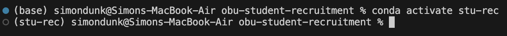

## Table of contents
- [General Info](#general-info)
- [Before Troubleshooting](#before-troubleshooting)
- [Install Conda Environment](#install-conda-environment)
- [Activate Conda Environment](#activate-conda-environment)
- [Updating Dependencies](#updating-dependencies)
    - [Update using pip](#update-using-pip)
    - [Update using conda](#update-using-conda)
- [Resetting Environment](#resetting-environment)
- [List Environment Packages](#list-env-packages)
- [Forced to Use Python3?](#forced-to-use-python3)
    - [Option 1](#option-1)
    - [Option 2](#option-2)
    - [Option 3](#option-3)


## General Info
A **Conda environment** is a self-contained directory that contains a specific version of Python and the packages that your project depends on. Using Conda environments allows you to manage dependencies, avoid conflicts, and keep your projects isolated from each other. When you activate a Conda environment, it ensures that the correct versions of libraries and packages are used for your project. This can be especially useful when working with different projects that may require different library versions.


Dependencies in a Conda environment are essentially external packages that your project needs in order to function properly. These can include anything from Flask and Numpy to more complex packages. Managing dependencies through a requirements file (like `requirements.txt` or `conda_install_reqs.sh`) helps ensure that all necessary libraries are installed and correctly versioned when setting up a new environment.


When setting up a Conda environment, it's common to encounter issues where some libraries may not be recognized or might need to be updated. In these cases, running the appropriate command to install or update dependencies using `pip` or `conda` can resolve these problems. If the environment is still not functioning correctly, it's sometimes necessary to reset or recreate the environment, which will give you a fresh setup to troubleshoot.


---


## Before Troubleshooting
All troubleshooting and flask interactions in general are intended to happen inside the `api` folder. No scripts will work outside of this folder because they will not be visible.


---


## Install conda environment
To install the conda environment run the bash script `setup-env-unix.sh` using this command:
```bash
bash setup-env-unix.sh
```


---


## Activate conda environment
To activate the conda environment, run the below command. The name of your current environment is shown inside the parentheses on the left side of your terminal line.


```bash
conda activate stu-rec
```


Here is an example of before and after activating the environment:





---


## Updating Dependencies
If new dependencies have been added, or your packages need version updating, run this command to re-install all listed packages. If an error still persists that says some package or module does not exist, check to see if the needed package is listed in [requirements.txt](requirements.txt) and [conda_install_reqs.sh](conda_install_reqs.sh).


---


### Update using pip
Running pip when the environment is active should install the packages as necessary. However, I have encountered some issues with this. Furthermore, after using a pip install, `conda list` (lists the installed libraries) does not show anything. Using the pip install option is a good place to start, but if troubles arise, try moving onto the direct [conda install](#update-using-conda) option.


```bash
pip install -r requirements.txt
```


---


### Update using conda
This option will install all the packages directly to the conda environment. After this is done, you can confirm the installs using [conda list](#list-env-packages)


```bash
bash conda_install_reqs.sh
```


---


## Resetting Environment
If you need to reset your conda environment for troubleshooting or testing, use the below command. Note, the best way to fully reset your environment is to delete it and re-create it. After running this command, you will have to re-create your environment. This should be done using the [bash script install method](#install-conda-environment) ([setup-env-unix.sh](setup-env-unix.sh))


---


## List env packages
To list all packages installed in your conda environment, run the below command. Note, if the packages were installed using `pip`, they might not show up when this command is run.


```bash
conda list
```


---


## Forced to use python3?
If you are forced to explicitly use `python3` instead of `python` in your commands. There are three options to solve this.


---


### Option 1
Simply manually replace `python` with `python3` whenever the problem occurs. This is the easiest solution but is slightly inconvenient.


---


### Option 2
You can make an alias to make `python` calls reference `python3`. Note, assigning an alias exists only for the current terminal session. Run this command in your terminal to create an alias for that instance:


```bash
alias python=python3
```


---


### Option 3
In testing, I ran into this problem when trying to run my flask server. I uses the [conda install method](#update-using-conda) to install my libraries and it fixed it for some reason. I cannot guarantee this as a solution, but it worked for me, so you can try it yourself.